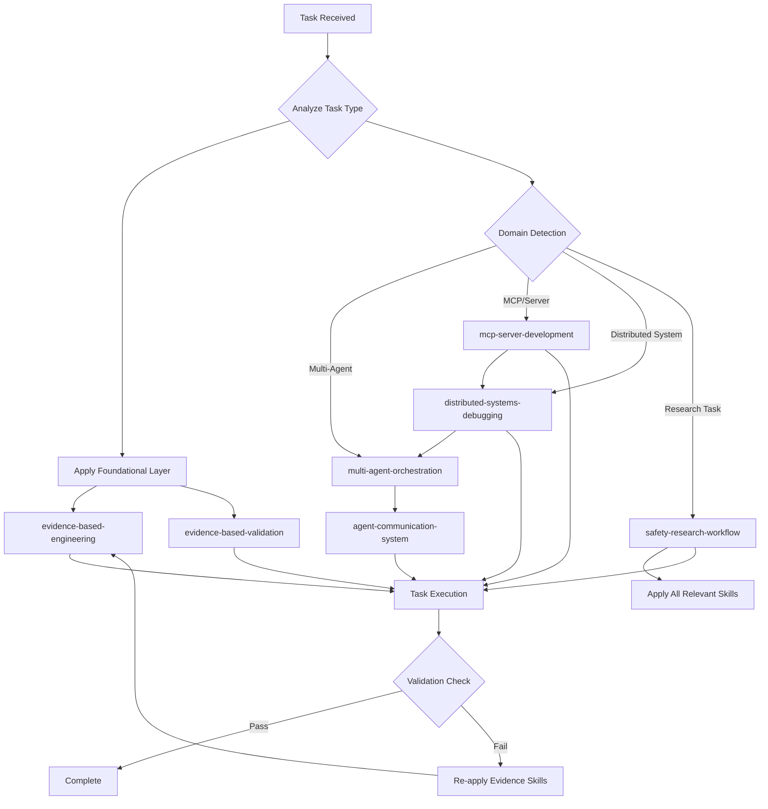

# Unified Skills Orchestrator

## Overview

The Unified Skills Orchestrator is a meta-skill that acts as an intelligent coordination layer above all individual skills in the Sartor Public Claude Skills Library. It automatically detects which skills should be activated for any given task, manages skill dependencies, prevents conflicts, and ensures foundational protocols are consistently applied.

**Key Capabilities:**
- Automatic skill detection and activation based on task analysis
- Hierarchical skill application (foundational → contextual → specialized)
- Conflict prevention and resolution between skills
- Intelligent skill chaining and handoff management
- Evidence-based validation as a universal foundation

## Skill Hierarchy

```
┌─────────────────────────────────────────────────┐
│            FOUNDATIONAL LAYER                   │
│  (Always Active - Non-Negotiable)               │
├─────────────────────────────────────────────────┤
│  • evidence-based-engineering                   │
│  • evidence-based-validation                    │
│    → Prevent fabrication, ensure verification   │
└─────────────────────────────────────────────────┘
                       ↓
┌─────────────────────────────────────────────────┐
│             DOMAIN LAYER                        │
│  (Context-Activated - Task Dependent)           │
├─────────────────────────────────────────────────┤
│  • multi-agent-orchestration                    │
│  • agent-communication-system                   │
│  • mcp-server-development                       │
│  • distributed-systems-debugging                │
│    → Applied based on technical domain          │
└─────────────────────────────────────────────────┘
                       ↓
┌─────────────────────────────────────────────────┐
│           SPECIALIZED LAYER                     │
│  (Explicitly Activated - Research/Analysis)     │
├─────────────────────────────────────────────────┤
│  • safety-research-workflow                     │
│    → Applied for research methodology           │
└─────────────────────────────────────────────────┘
```

## Skill Activation Matrix

| Task Category | Primary Skills | Supporting Skills | Validation Layer |
|--------------|----------------|-------------------|------------------|
| **Code Implementation** | Domain-specific skill | - | evidence-based-engineering |
| **Multi-Agent System** | multi-agent-orchestration | agent-communication-system | evidence-based-validation |
| **MCP Server Creation** | mcp-server-development | distributed-systems-debugging | evidence-based-engineering |
| **Distributed Debugging** | distributed-systems-debugging | multi-agent-orchestration | evidence-based-validation |
| **Research & Analysis** | safety-research-workflow | All relevant domain skills | evidence-based-engineering + validation |
| **System Architecture** | multi-agent-orchestration | agent-communication-system, distributed-systems-debugging | evidence-based-validation |
| **Performance Claims** | evidence-based-engineering | Relevant domain skill | evidence-based-validation |
| **Communication Protocol** | agent-communication-system | multi-agent-orchestration | evidence-based-engineering |

## Skill Dependency Graph



## Integration Patterns

### Pattern 1: Evidence-First Development
```
ALWAYS:
1. evidence-based-engineering (foundation)
2. Domain skill (implementation)
3. evidence-based-validation (verification)
```

### Pattern 2: Multi-Agent System Development
```
SEQUENCE:
1. evidence-based-engineering (anti-fabrication)
2. multi-agent-orchestration (architecture)
3. agent-communication-system (implementation)
4. distributed-systems-debugging (troubleshooting)
5. evidence-based-validation (verification)
```

### Pattern 3: MCP Server Development
```
SEQUENCE:
1. evidence-based-engineering (metrics foundation)
2. mcp-server-development (core implementation)
3. distributed-systems-debugging (integration testing)
4. evidence-based-validation (performance verification)
```

### Pattern 4: Research Workflow
```
COMPREHENSIVE:
1. safety-research-workflow (methodology)
2. evidence-based-engineering (data integrity)
3. [All relevant domain skills for analysis]
4. evidence-based-validation (results verification)
```

## Decision Framework

### Step 1: Initial Task Analysis
```python
def analyze_task(user_request):
    keywords = extract_keywords(user_request)

    # ALWAYS activate foundational skills
    active_skills = [
        'evidence-based-engineering',
        'evidence-based-validation'
    ]

    # Domain detection
    if contains(keywords, ['agent', 'consensus', 'coordination']):
        active_skills.append('multi-agent-orchestration')

    if contains(keywords, ['message', 'protocol', 'communication']):
        active_skills.append('agent-communication-system')

    if contains(keywords, ['mcp', 'server', 'tool']):
        active_skills.append('mcp-server-development')

    if contains(keywords, ['debug', 'distributed', 'trace']):
        active_skills.append('distributed-systems-debugging')

    if contains(keywords, ['research', 'analyze', 'methodology']):
        active_skills.append('safety-research-workflow')

    return prioritize_skills(active_skills)
```

### Step 2: Skill Prioritization
```
PRIORITY ORDER:
1. Evidence-based skills (ALWAYS first)
2. Architectural skills (multi-agent-orchestration)
3. Implementation skills (agent-communication, mcp-server)
4. Debugging skills (distributed-systems-debugging)
5. Research skills (safety-research-workflow)
```

### Step 3: Conflict Resolution
```
CONFLICT RULES:
- If multiple domain skills apply, use most specific first
- If implementation conflicts with evidence, evidence wins
- If debugging reveals issues, loop back to implementation
- Research workflow overrides standard patterns when activated
```

## Common Skill Combinations

### 1. Full-Stack Agent Development
```
Activation Sequence:
├── evidence-based-engineering
├── multi-agent-orchestration
├── agent-communication-system
├── distributed-systems-debugging
└── evidence-based-validation
```

### 2. MCP Tool Development
```
Activation Sequence:
├── evidence-based-engineering
├── mcp-server-development
├── distributed-systems-debugging (if networked)
└── evidence-based-validation
```

### 3. System Architecture Review
```
Activation Sequence:
├── evidence-based-engineering
├── safety-research-workflow
├── multi-agent-orchestration
├── distributed-systems-debugging
└── evidence-based-validation
```

### 4. Performance Optimization
```
Activation Sequence:
├── evidence-based-engineering (baseline metrics)
├── distributed-systems-debugging (profiling)
├── [Relevant domain skill]
└── evidence-based-validation (verification)
```

## Anti-Patterns (What NOT to Do)

### ❌ NEVER Skip Foundational Layer
```
WRONG:
Task → multi-agent-orchestration → Complete

RIGHT:
Task → evidence-based-engineering → multi-agent-orchestration → evidence-based-validation → Complete
```

### ❌ NEVER Activate Conflicting Skills Simultaneously
```
WRONG:
- Running mcp-server-development and multi-agent-orchestration in parallel for same component

RIGHT:
- Determine primary focus, activate sequentially with clear handoffs
```

### ❌ NEVER Ignore Skill Dependencies
```
WRONG:
- Using agent-communication-system without multi-agent-orchestration context

RIGHT:
- Activate multi-agent-orchestration first to establish architecture
```

### ❌ NEVER Apply Research Workflow to Simple Tasks
```
WRONG:
- Activating safety-research-workflow for basic code implementation

RIGHT:
- Reserve research workflow for complex analysis requiring methodology
```

## When to Use This Orchestrator

**ALWAYS use the orchestrator when:**
1. Task involves multiple technical domains
2. You're unsure which skills apply
3. Task requires both implementation and validation
4. Working on distributed or multi-agent systems
5. Need to ensure evidence-based practices
6. Complex tasks requiring skill coordination

**Specific Triggers:**
- "Build a multi-agent system..." → Full orchestration
- "Debug this distributed..." → Debugging + evidence chain
- "Create an MCP server..." → MCP + validation chain
- "Analyze the architecture..." → Research + all relevant skills
- "Verify performance of..." → Evidence chain + domain skills

## When NOT to Use This Orchestrator

**Skip orchestration when:**
1. Single, simple task with clear skill mapping
2. Explicitly targeting one specific skill
3. Pure conceptual discussion without implementation
4. Emergency debugging requiring immediate action
5. User explicitly requests single skill activation

**Direct Skill Access:**
- "Just use the MCP skill" → Direct activation
- "Apply only evidence-based validation" → Single skill
- "Quick hypothetical question" → No orchestration needed

## Orchestrator Execution Protocol

### Phase 1: Initialization
```
1. Parse user request
2. Extract task categories and keywords
3. Identify potential skill requirements
4. Check for skill conflicts
```

### Phase 2: Skill Activation
```
1. ALWAYS activate evidence-based-engineering first
2. Activate primary domain skill(s)
3. Activate supporting skills as needed
4. Queue evidence-based-validation for end
```

### Phase 3: Execution Management
```
1. Monitor skill outputs
2. Handle inter-skill communication
3. Resolve conflicts in real-time
4. Manage skill handoffs
```

### Phase 4: Validation & Completion
```
1. Run evidence-based-validation
2. Verify all skill objectives met
3. Check for missing coverage
4. Generate consolidated output
```

## Skill Handoff Protocols

### Multi-Agent → Communication
```
Handoff Trigger: Architecture defined, need protocol implementation
Handoff Data: Agent roles, message types, consensus requirements
Next Skill: agent-communication-system
```

### MCP Development → Debugging
```
Handoff Trigger: Server implemented, needs integration testing
Handoff Data: Endpoints, tool definitions, error logs
Next Skill: distributed-systems-debugging
```

### Evidence Engineering → Domain Skill
```
Handoff Trigger: Metrics baseline established
Handoff Data: Performance requirements, validation criteria
Next Skill: [Appropriate domain skill]
```

### Domain Skill → Evidence Validation
```
Handoff Trigger: Implementation complete
Handoff Data: Claimed metrics, test results, performance data
Next Skill: evidence-based-validation
```

## Advanced Orchestration Patterns

### Dynamic Skill Weighting
```python
skill_weights = {
    'evidence-based-engineering': 1.0,  # Always maximum
    'evidence-based-validation': 1.0,   # Always maximum
    'multi-agent-orchestration': task_complexity_score,
    'agent-communication-system': protocol_complexity_score,
    'mcp-server-development': mcp_relevance_score,
    'distributed-systems-debugging': debug_necessity_score,
    'safety-research-workflow': research_depth_score
}
```

### Skill Feedback Loops
```
If validation fails:
  → Re-activate evidence-based-engineering
  → Re-examine domain skill application
  → Adjust parameters
  → Retry with enhanced validation
```

### Cascading Activation
```
Initial: evidence-based-engineering
  → Discovers multi-agent requirement
    → Activates multi-agent-orchestration
      → Identifies communication needs
        → Activates agent-communication-system
          → Reveals debugging requirement
            → Activates distributed-systems-debugging
```

## Monitoring & Metrics

The orchestrator tracks:
- Skills activated per task
- Skill activation frequency
- Skill combination success rates
- Conflict resolution events
- Validation pass/fail rates
- Average skills per task
- Handoff efficiency

## Summary

The Unified Skills Orchestrator ensures that every task benefits from the full power of the Sartor Public Claude Skills Library while maintaining efficiency and preventing conflicts. By establishing clear hierarchies, dependencies, and handoff protocols, it creates a seamless experience where skills work together harmoniously rather than in isolation.

**Remember:** Evidence-based practices are non-negotiable. Every claim, metric, and assertion must be verifiable. The orchestrator enforces this as its prime directive while intelligently applying domain expertise as needed.