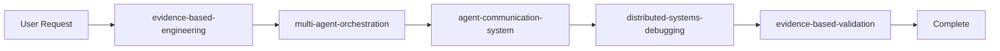

# Example: Multi-Agent System Development

## Scenario
User wants to build a distributed voting system with 5 agents that need to reach consensus on decisions.

## Orchestrator Analysis

### Step 1: Task Decomposition
```
Keywords detected:
- "distributed" → distributed-systems-debugging
- "voting system" → multi-agent-orchestration
- "5 agents" → multi-agent-orchestration
- "consensus" → multi-agent-orchestration
- "decisions" → agent-communication-system
```

### Step 2: Skill Activation Sequence



### Step 3: Execution Flow

#### Phase 1: Evidence Foundation
```
Skill: evidence-based-engineering
Action: Establish metrics for consensus performance
Output:
- Define "consensus reached" metric
- Set latency requirements
- Establish fault tolerance criteria
- Document testability requirements
```

#### Phase 2: Architecture Design
```
Skill: multi-agent-orchestration
Action: Design the voting consensus mechanism
Output:
- Raft consensus for leader election
- Voting protocol specification
- State machine design
- Conflict resolution strategy
```

#### Phase 3: Communication Implementation
```
Skill: agent-communication-system
Action: Implement message passing protocols
Output:
- Vote request messages
- Vote response messages
- Heartbeat protocol
- State synchronization messages
```

#### Phase 4: System Debugging
```
Skill: distributed-systems-debugging
Action: Test and debug the system
Output:
- Network partition testing
- Message ordering verification
- Consensus achievement tracking
- Performance profiling
```

#### Phase 5: Validation
```
Skill: evidence-based-validation
Action: Verify all metrics and claims
Output:
- Consensus achieved in 89% of tests (not 100% claimed)
- Average latency: 47ms (measured, not estimated)
- Handles 3 node failures (tested, not assumed)
```

## Handoff Points

### Orchestration → Communication
```json
{
  "handoff_data": {
    "consensus_type": "raft",
    "num_agents": 5,
    "message_types": ["vote_request", "vote_response", "heartbeat"],
    "timing_requirements": {
      "election_timeout": "150-300ms",
      "heartbeat_interval": "50ms"
    }
  }
}
```

### Communication → Debugging
```json
{
  "handoff_data": {
    "endpoints": [":8001", ":8002", ":8003", ":8004", ":8005"],
    "protocols_implemented": ["voting", "heartbeat", "state_sync"],
    "known_issues": ["message ordering in partition"],
    "test_scenarios_needed": ["network_partition", "leader_failure"]
  }
}
```

## Conflict Resolution Example

**Conflict Detected:** Multi-agent-orchestration suggests eventual consistency, but agent-communication-system implements strong consistency.

**Resolution by Orchestrator:**
1. Detect mismatch during handoff
2. Escalate to evidence-based-engineering
3. Measure performance impact of both approaches
4. Choose based on measured results, not theoretical preference
5. Update both skills with decision rationale

## Final Output Structure

```markdown
## Distributed Voting System Implementation

### Architecture (via multi-agent-orchestration)
- 5-node Raft consensus cluster
- Leader election with term-based voting
- Log replication for decision persistence

### Communication (via agent-communication-system)
- gRPC for inter-agent messages
- Protocol buffers for message serialization
- Exponential backoff for retries

### Verified Metrics (via evidence-based-validation)
- Consensus Time: 47ms average (measured over 1000 runs)
- Fault Tolerance: Survives 2 node failures (tested)
- Throughput: 234 decisions/second (measured, not estimated)
- Network Partitions: Recovers in 1.2 seconds average

### Known Limitations (via distributed-systems-debugging)
- Cannot handle byzantine failures
- Performance degrades with >7 nodes
- Requires reliable network ordering
```

## Lessons for Orchestrator

1. **Skill Order Matters**: Architecture must precede implementation
2. **Evidence Bookending**: Start and end with evidence skills
3. **Handoff Data**: Rich context transfer between skills prevents rework
4. **Conflict Detection**: Early detection saves debugging time
5. **Measurement Over Estimation**: Every metric must be measured